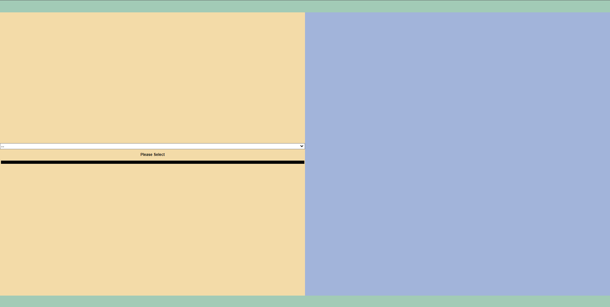
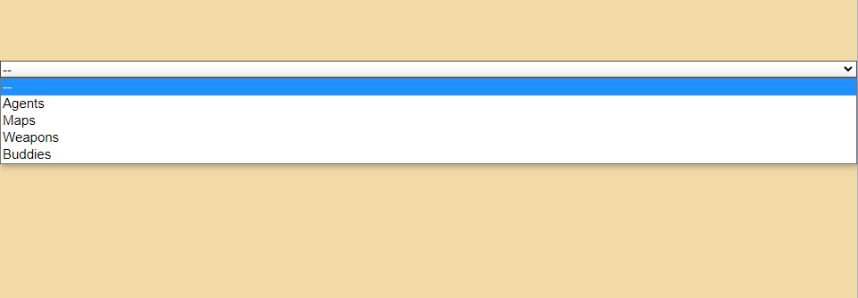
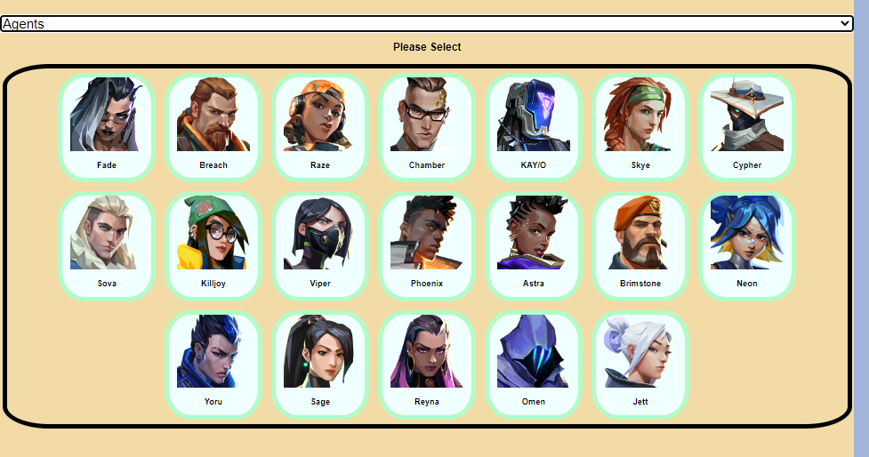
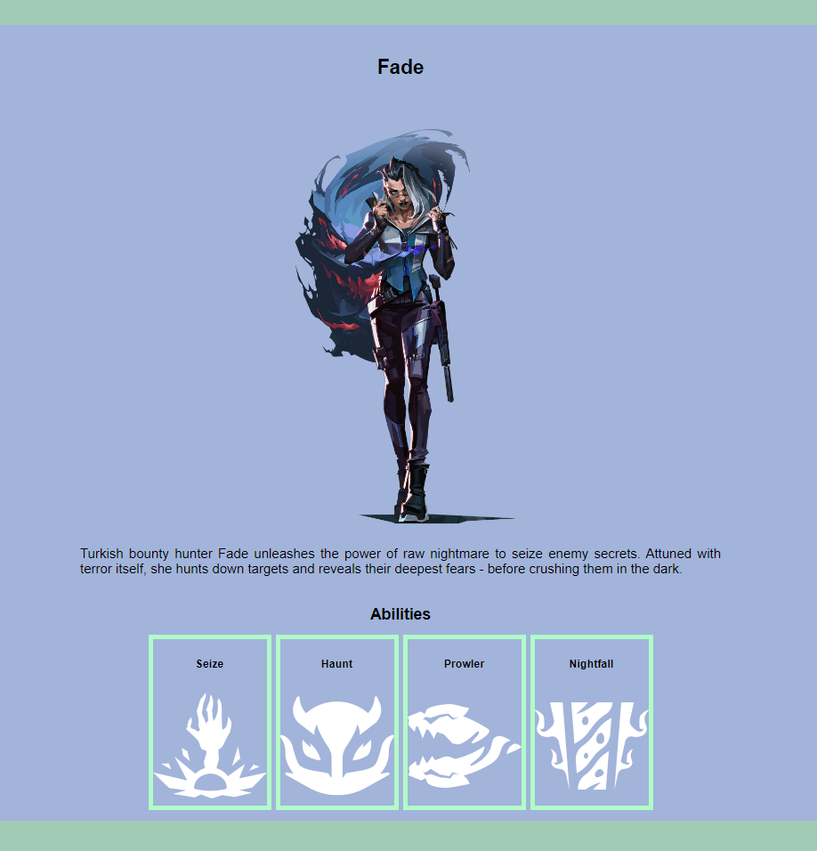
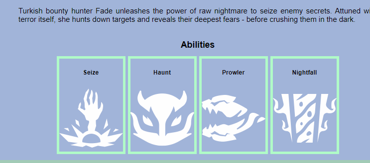

# Valorant Game Info

#### A starting point for information about the game Valorant.

## Description
This website is used as a little WIKI to find out information about characters, maps, weapons, in the game Valorant.

## Table of Contents
* [Technologies Used](#technologiesused)
* [Features](#features)
* [Design](#design)
* [Project Next Steps](#nextsteps)
* [Deployed App](#deployment)
* [About the Author](#author)

## Technologies Used
* JavaScript
* HTML5
* CSS3
* jQuery

## Features
* Users can select through multiple contents(Agents, Maps, Weapons)
* Users can view Agent portraits, description, abilities, and ability description on hover
* Users can view overhead Map pictures, as well as coordinates of the map that it is based on
* Users can view pictures of Weapons that are in the game

## Screenshots
* Current Main Page
    
* Information select list
    
*  Agent list menu
    
* Agent full information section
    
* Agent ability descritpion
    

## Planning
* Planning was done by using Trello

## Design
* Structure of the website was done by using mainly CSS3.
* The design is not complete, and will be completed soon. 

## Project Next Steps
* Creatively design website appearance
* In the weapon menu, users will be able to choose different kind of skins that are in the game.
* Users will be able to view "buddies" for weapons
* More information like sound clips of Agents and Weapons

## Deployed Link
[Netlify](https://game-info-project.netlify.app/)

* You can view the repository:
[Github.com](https://github.com/ilsuryuz/Game-Info)
* If unable to view please go live locally through VS Code
    
## Works Cited:
* Dropdown menu function
    [StackOverflow](https://stackoverflow.com/questions/18491179/select-different-options-at-an-select-form-and-show-different-content)
* .empty() function 
    [W3Schools](https://www.w3schools.com/jquery/html_empty.asp#:~:text=The%20empty()%20method%20removes,use%20the%20remove()%20method)

## About The Author
I like gaming, and this is my first big project to start. So far It has been very fun to do and I cannot wait to add more to this one as well as build new projects!
